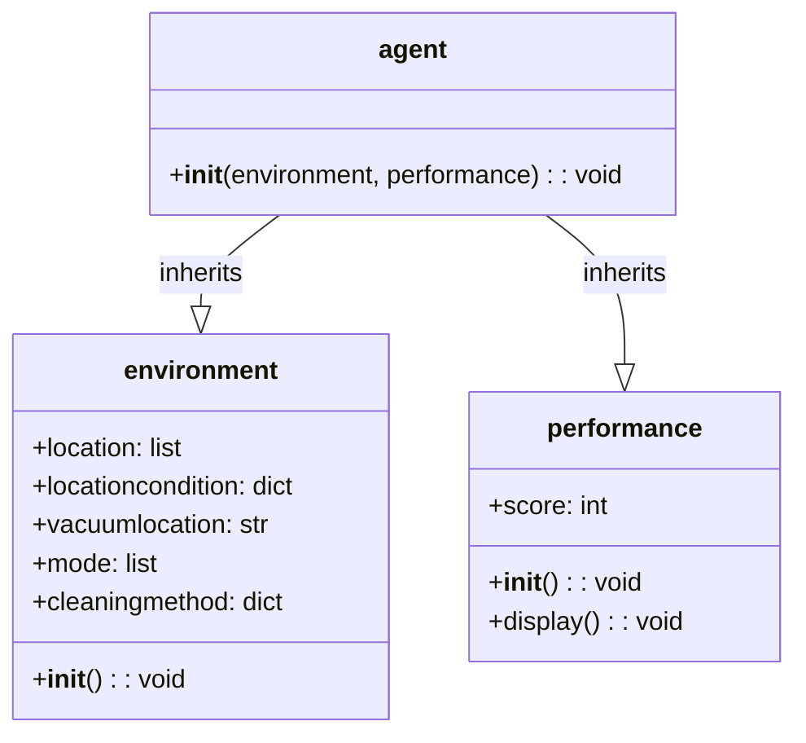
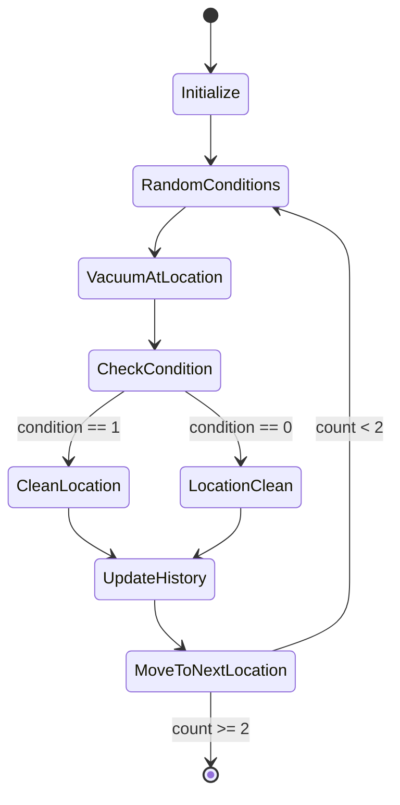
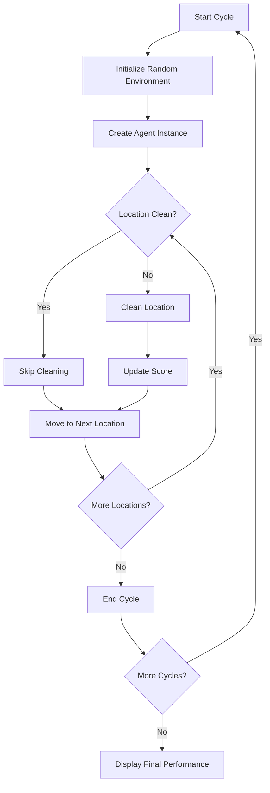

# Utility-Based Agents Project

A comprehensive implementation of utility-based agents using the vacuum cleaning domain as a practical example. This project demonstrates how intelligent agents make decisions based on utility calculations to maximize performance in stochastic environments.

[](https://opensource.org/licenses/MIT)
[](https://www.python.org/)

---

## Table of Contents

- [Overview](#overview)
- [Architecture](#architecture)
- [Quick Start](#quick-start)
- [Agent Design](#agent-design)
- [Environment Model](#environment-model)
- [Performance Metrics](#performance-metrics)
- [Code Structure](#code-structure)
- [Installation](#installation)
- [Usage Examples](#usage-examples)
- [Workflow Diagrams](#workflow-diagrams)
- [Configuration](#configuration)
- [Extending the Agent](#extending-the-agent)
- [API Reference](#api-reference)
- [Troubleshooting](#troubleshooting)
- [Contributing](#contributing)
- [License](#license)

---

## Overview

Utility-based agents are a fundamental concept in artificial intelligence that make decisions by evaluating the expected utility of each possible action. This project implements a vacuum cleaning agent that:

- **Perceives** environmental conditions (dirt status in two locations)
- **Evaluates** cleaning methods based on utility calculations
- **Acts** to maximize overall performance across multiple cycles
- **Learns** from environmental changes over time


### Key Features

| Feature | Description |
|---------|-------------|
| Multi-location Support | Handles multiple cleaning zones (A and B) |
| Stochastic Environment | Random dirt generation and vacuum placement |
| Dynamic Decision Making | Real-time utility evaluation for actions |
| Performance Tracking | Score-based performance metrics |
| Modular Design | Extensible class hierarchy |

---

## Architecture

The system follows an object-oriented design with clear separation of concerns:

```
┌─────────────────────────────────────────────────────────────┐
│                    Main Execution Loop                      │
│                          (24 cycles)                        │
└─────────────────────────────────────────────────────────────┘
                              │
              ┌───────────────┴─────────────┐
              ▼                             ▼
  ┌─────────────────────┐       ┌─────────────────────┐
  │    Environment      │       │    Performance      │
  │                     │       │                     │
  │ ─ location          │       │ ─ score (0-48)      │
  │ ─ locationcondition │       │ ─ display()         │
  │ ─ vacuumlocation    │       └─────────────────────┘
  │ ─ cleaningmethod    │                 ▲
  └─────────────────────┘                 │
              ▲                           │
              └───────────────────────────┘
              │
              ▼
  ┌─────────────────────┐
  │       Agent         │
  │   (Combines both)   │
  └─────────────────────┘
```

### Class Hierarchy



---

## Quick Start

```bash
# Clone the repository
git clone https://github.com/yourusername/utility-based-agents.git
cd utility-based-agents

# Run the simulation
python3 utility-based\ agent.tex  # Convert and run the LaTeX Python code
```

---

## Agent Design

### Core Components

#### 1. Performance Class

Tracks and evaluates agent performance over time:

```python
class performance:
    def __init__(self):
        self.score = 0
    
    def display(self):
        print("Score:", self.score)
        print("Performance:", (self.score / 48) * 100, "%")
```

**Score Calculation:**
- Maximum possible score: 48 (24 cycles × 2 cleanings per cycle)
- Each location cleaning adds 1 point
- Performance percentage = (score / 48) × 100

#### 2. Environment Class

Models the stochastic environment state:

| Attribute | Type | Description | Values |
|-----------|------|-------------|--------|
|  `location`  |  `list`  |  Available locations  | `["A", "B"]` |
| `locationcondition` | `dict` | Dirt status per location | `{"A": 0/1, "B": 0/1}` |
| `vacuumlocation` | `str` | Current vacuum position | `"A"` or `"B"` |
| `mode` | `list` | Cleaning methods | `["T", "L"]` |
| `cleaningmethod` | `dict` | Method per location | `{"A": "T"/"L", "B": "T"/"L"}` |

**Cleaning Methods Legend:**

| Code | Method | Description |
|------|--------|-------------|
| `T` | Standard/Traditional | Standard vacuum cleaning approach |
| `L` | Alternative/Lightweight | Lightweight or alternative cleaning method |

#### 3. Agent Class

Makes decisions based on current environmental state:

| Decision Factor | Logic |
|---------------|-------|
| Clean if dirty  | `locationcondition[vacuumlocation] == 1`  |
| Switch method  | Toggle between "T" and "L" after cleaning  |
| Move location  | Cycle to next index (A→B→A)  |
| Update state  | Reset cleaned location to 0, log cleaning history  |

---

## Environment Model

The environment operates on the following principles:

### State Transition Diagram



### Environment Variables Table

| Variable | Initial Range | Meaning |
|----------|---------------|---------|
| `locationcondition["A"]` | 0 or 1 | A is clean (0) or dirty (1) |
| `locationcondition["B"]` | 0 or 1 | B is clean (0) or dirty (1) |
| `vacuumlocation` | "A" or "B" | Starting position |
| `cleaningmethod["A"]` | "T" or "L" | Cleaning method for location A |
| `cleaningmethod["B"]` | "T" or "L" | Cleaning method for location B |

---

## Performance Metrics

### Metrics Dashboard

| Metric | Value Range | Description |
|--------|-------------|-------------|
| Score | 0-48 | Total successful cleanings |
| Performance % | 0-100% | Efficiency ratio |
| Cycles Executed | 0-24 | Number of simulation runs |
| Cleanings per Cycle | 0-2 | Action efficiency per cycle |

### Sample Output Interpretation

```
Environment condition {'A': 1, 'B': 0} Vacuum location B cleaning method {'A': 'L', 'B': 'T'}
B Is clean
A Has been cleaned
```

**Breakdown:**
- Location A is dirty (1), Location B is clean (0)
- Vacuum starts at Location B
- Cleaning methods are L for A, T for B
- B requires no cleaning (already clean)
- A gets cleaned, score incremented

---

## Code Structure

```
utility-based-agents/
├── README.md                    # This documentation
├── utility-based agent.tex        # LaTeX source with embedded Python
└── (future) agent_core.py       # Core implementation (planned)
```

### File Organization

| File | Purpose | Language |
|------|---------|----------|
| `utility-based agent.tex` | Main implementation and output | LaTeX + Python |

---

## Installation

### Prerequisites

- Python 3.x
- LaTeX distribution (TeX Live, MiKTeX, or MacTeX)
- Pandoc (for conversion)

### Setup

```bash
# Install Python dependencies (none required for basic version)
pip install -r requirements.txt 2>/dev/null || echo "No requirements file - pure Python"

# Install LaTeX packages (if needed)
tlmgr install texlive-latex-base texlive-fonts-recommended texlive-latex-extra
```

---

## Usage Examples

### Running the Simulation

```python
# Direct Python execution (extracted from LaTeX)
import random
import time

# Create performance tracker
thescore = performance()

# Run 24 cycles
x = 0
while x < 24:
    e1 = environment()  # New random environment
    a1 = agent(e1, thescore)  # Agent acts
    x += 1
    time.sleep(1)

# Display final results
thescore.display()
```

### Custom Environment Configuration

To modify the environment for testing:

```python
# Modify the environment class for deterministic tests
class test_environment(environment):
    def __init__(self):
        self.location = ["A", "B"]
        self.locationcondition = {"A": 1, "B": 1}  # Both dirty
        self.vacuumlocation = "A"
        self.mode = ["T", "L"]
        self.cleaningmethod = {"A": "T", "B": "T"}
```

---

## Workflow Diagrams

### Execution Flow



### Agent Decision Matrix

| Current Location | Condition | Action | Utility Gain |
|----------------|-----------|--------|--------------|
| A | Dirty (1) | Clean with T/L | +1 score |
| A | Clean (0) | Move to B | 0 |
| B | Dirty (1) | Clean with T/L | +1 score |
| B | Clean (0) | Move to A | 0 |

---

## Configuration

### Tunable Parameters

| Parameter | Location | Default | Description |
|-----------|----------|---------|-------------|
| Cycles | `while x < 24` | 24 | Number of simulation rounds |
| Max Score | `score / 48` | 48 | Maximum achievable score |
| Sleep Time | `time.sleep(1)` | 1s | Delay between cycles |
| Locations | `["A", "B"]` | 2 | Number of cleanable zones |

### Environment Randomness

| Random Element | Source | Range |
|----------------|--------|-------|
| Initial condition A | `random.randint(0,1)` | 0 or 1 |
| Initial condition B | `random.randint(0,1)` | 0 or 1 |
| Vacuum start | `random.choice(location)` | A or B |
| Cleaning method | `random.choice(mode)` | T or L |

---

## Extending the Agent

### Adding New Locations

```python
# Extend to 3 locations
class extended_environment(environment):
    def __init__(self):
        self.location = ["A", "B", "C"]
        # ... additional setup
```

### Adding New Cleaning Methods

```python
# Add deep cleaning option
self.mode = ["T", "L", "D"]  # Traditional, Lightweight, Deep
```

### Multi-Agent Support

```python
# Future enhancement placeholder
class multi_agent_system:
    def __init__(self):
        self.agents = [agent(environment(), performance()) for _ in range(n)]
```

---

## API Reference

### performance Class

| Method | Parameters | Returns | Description |
|--------|------------|---------|-------------|
| `__init__` | None | `performance` object | Initialize score to 0 |
| `display` | None | `None` (prints) | Show current score and percentage |

### environment Class

| Attribute | Type | Description |
|-----------|------|-------------|
| `location` | `list[str]` | Available cleaning locations |
| `locationcondition` | `dict[str, int]` | Dirt status (0=clean, 1=dirty) |
| `vacuumlocation` | `str` | Current vacuum position |
| `mode` | `list[str]` | Available cleaning methods |
| `cleaningmethod` | `dict[str, str]` | Method assignment per location |

### agent Class (inherits from both)

| Method | Parameters | Returns | Description |
|--------|------------|---------|-------------|
| `__init__` | `environment`, `performance` | `agent` object | Initialize agent, run cleaning cycle |

---

## Troubleshooting

### Common Issues

| Problem | Cause | Solution |
|---------|-------|----------|
| Score stays at 0 | All locations start clean | Check random seed or run more cycles |
| No output | Indentation error | Ensure proper Python syntax in conversion |
| Performance < 50% | Random conditions unfavorable | Reduce sleep time, increase cycles |

### Debugging Tips

```python
# Add verbose output for debugging
import random
random.seed(42)  # For reproducible results
```

---

## Technical Specifications

### System Requirements

| Requirement | Minimum | Recommended |
|-------------|---------|-------------|
| Python | 3.6 | 3.9+ |
| Memory | 512MB | 1GB+ |
| Storage | 10MB | 50MB |

### Dependencies Tree

```
Python Standard Library
├── random
├── time
└── (no external dependencies)
```

---

## Performance Analysis

### Expected Results

Based on probability theory with 24 cycles:

| Scenario | Probability | Expected Score |
|----------|-------------|----------------|
| Both clean | 25% | 0 |
| One dirty | 50% | 1 |
| Both dirty | 25% | 2 |
| **Average per cycle** | - | **1.0** |
| **Total expected** | - | **24** |

---

## Contributing

1. Fork the repository
2. Create a feature branch (`git checkout -b feature/AmazingFeature`)
3. Make changes to the LaTeX/Python code
4. Test the conversion and execution
5. Submit a pull request

---

## License

MIT License - See [LICENSE](LICENSE) for details

---

## Acknowledgments

- Based on Russell & Norvig's AI: A Modern Approach concepts
- Inspired by vacuum world problems in agent theory

---

*This README was generated for the Utility-Based Agents project. For updates and bug reports, please open an issue on the repository.*
